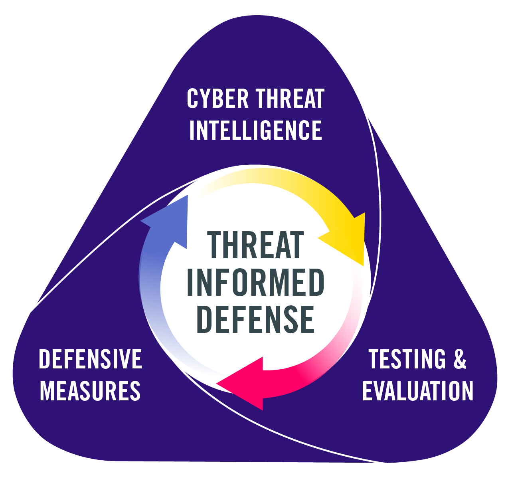

Three Dimensions of Threat-Informed Defense
===========================================

How can an organization implement or improve their threat-informed defense? The starting
point depends on the degree to which the organization currently incorporates cyber
threat information. At a minimum, the organization can take the perspective of an
adversary and think about what an adversary might do to attack their organization.
Thinking this way helps to identify priorities in security and leads to a series of
questions such as: What adversaries are known to target my industry or my organization?
What are these adversaries capable of? How well is my organization currently prepared to
mitigate, detect, or resiliently operate despite a malicious cyber-attack by such
adversaries? What should my organization do next to be better prepared? The three
dimensions of threat-informed defense described below help organizations determine where
they are in this process and recommended practices for improving.

The goal of this project is to help any organization begin to implement threat-informed
defense in their security program, to measure their current state of implementation, and
create a plan for continually maturing the implementation. In the sections that follow,
the three dimensions of threat-informed defense are explained, as well as their key
components. These components are discussed in more detail in :doc:`components/index`.

Threat-Informed Defense Cycle
-----------------------------

   The Threat-Informed Defense Cycle

Threat-informed defense is a continuous process in which defenders and adversaries are
constantly learning and evolving. To implement an effective threat-informed defense, an
organization must understand the threat and implement effective defensive measures. To
understand the efficacy of existing or planned defensive measures and identify defensive
gaps, an organization must evaluate their current posture, as well as potential new
defensive measures, against the known threats. The three dimensions of threat-informed
defense are:

1. Cyber Threat Intelligence (CTI)
2. Defensive (Counter) Measures
3. Testing & Evaluation

Crucial to this idea of threat-informed defense is this imperative of proactive defense.
An effective threat-informed defense must continuously learn and evolve to optimally
implement defensive measures to keep pace with new threats and technologies.

In the sections that follow, the three main dimensions of thread-informed defense will
be explained, as well as their key components. These components and their best practices
are discussed in more detail in :doc:`components/index`.

Cyber Threat Intelligence - Know the Adversary
----------------------------------------------

The first dimension of threat-informed defense is Cyber Threat Intelligence (CTI), which
is focused on understanding the adversary. This dimension measures how well the
organization understands known behaviors of cyber adversaries; which specific
adversaries are targeting its industry, technologies, or geography; and their
motivations and typical objectives. Ultimately CTI programs enable organizations to
produce a tailored threat model of the highest priority adversary behaviors, which
ultimately informs the rest of the defensive program. Example capabilities such as the
`Top ATT&CK Technique Calculator
<https://top-attack-techniques.mitre-engenuity.org/#/calculator>`_ can help organizations
with this initial tailoring based on a variety of factors.

.. figure:: _static/topattackttp.png
   :alt: Top ATT&CK Techniques Calculator
   :align: center

   Top ATT&CK Techniques Calculator

The `Cyber Threat Intelligence Lifecycle
<https://recordedfuture.com/blog/threat-intelligence-lifecycle-phases>`_, a product from
`Recorded Future <https://www.recordedfuture.com/>`_, consists of Direction, Collection,
Processing, Analysis, and Dissemination. The components in the M3TID model exist as the
inputs and outputs of the phases of the cycle. The combination of these components
amount to how detailed an organization’s threat model and understanding of that threat
model is.

.. figure:: _static/rflifecycle.png
   :alt: Recorded Future Threat Intelligence Lifecycle
   :align: center

   Recorded Future Threat Intelligence Lifecycle

The key components of CTI are:

1. Depth of Threat Data
2. Breadth of Threat Information
3. Relevance of Threat Data
4. Utilization of Threat Information
5. Dissemination of Threat Reporting

As described in more detail below, ultimately the understanding derived from CTI informs
the next two dimensons of threat-informed defense.

Defensive Measures - Proactively Defend
---------------------------------------

Defensive Measures is core to the concept of threat-informed defense. Once an
organization understands the adversary, if they do not implement real change in their
organization based on what they learn, then they are not achieving the impact of
threat-informed defense. Importantly, many organizations might consider that
threat-informed defense only applies to technical defenses, but the concept should apply
across all aspects of a security program. An example of evolving defensive measures is
the Center's `Summitting the Pyramid
<https://mitre.org/cybersecurity/center-for-threat-informed-defense/our-work/summiting-the-pyramid/>`_
proejct, which uses knowledge of adversary tradecraft to create more robust cyber
detections.

.. figure:: _static/stp.png
   :alt: Summiting the Pyramid
   :align: center

   Summiting the Pyramid

The key Components of Defensive Measures are:

1. Foundational Security
2. Data Collection
3. Detection Engineering
4. Incident Response
5. Deception Operations

Although improvements in defenses typically result in a technical defensive measure,
that does not have to mean a firewall rule or a new detection rule in a SIEM. Any action
taken to make a network or system more secure can benefit from insight into threats.
This could be stronger policies, prioritized patching, new detections, deception
operations, or additional security training.

Testing & Evaluation - Learn and Improve
----------------------------------------

Testing and Evaluation helps an organization validate and grow. By testing against
adversary realistic TTPs, an organization can validate their defenses and discover gaps.
By continuously testing based on updated threat knowledge and new approaches to
adversary TTPs, an organization maintains a realistic picture of their security posture.
For example, red or purple team exercises should leverage *adversary emulation*, which
means replicating the behaviors and attack flow of specific, relevant adversaries. The
graphic below shows the high level `FIN6 attack plan
<https://medium.com/mitre/center-releases-fin6-adversary-emulation-plan-775d8c5ebe9b>`_
taken from the Center’s `Adversary Emulation library
<https://mitre.org/cybersecurity/center-for-threat-informed-defense/adversary-emulation-library/>`_.

.. figure:: _static/fin6advemu.png
   :alt: FIN6 Adversary Emulation Plan
   :align: center
   :width: 75%

   FIN6 Adversary Emulation Plan

Beyond that, testing can drive product or architecture changes to improve security,
inform detection engineering and incident response, validate defensive controls, as well
as other areas. Testing is an important way to rehearse before any real compromise
occurs.

The key Components of T&E are:

1. Type of Testing
2. Frequency of Testing
3. Test Planning
4. Test Execution
5. Test Results
