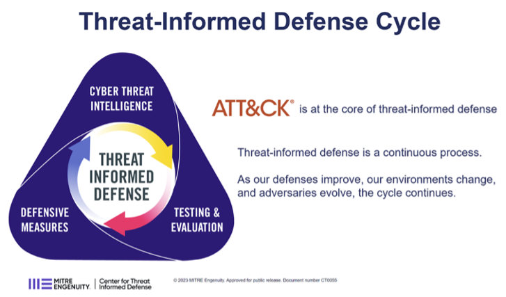
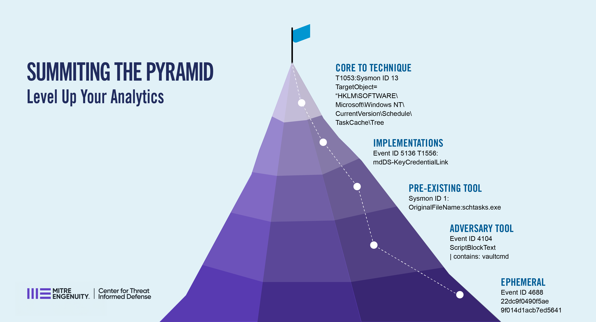
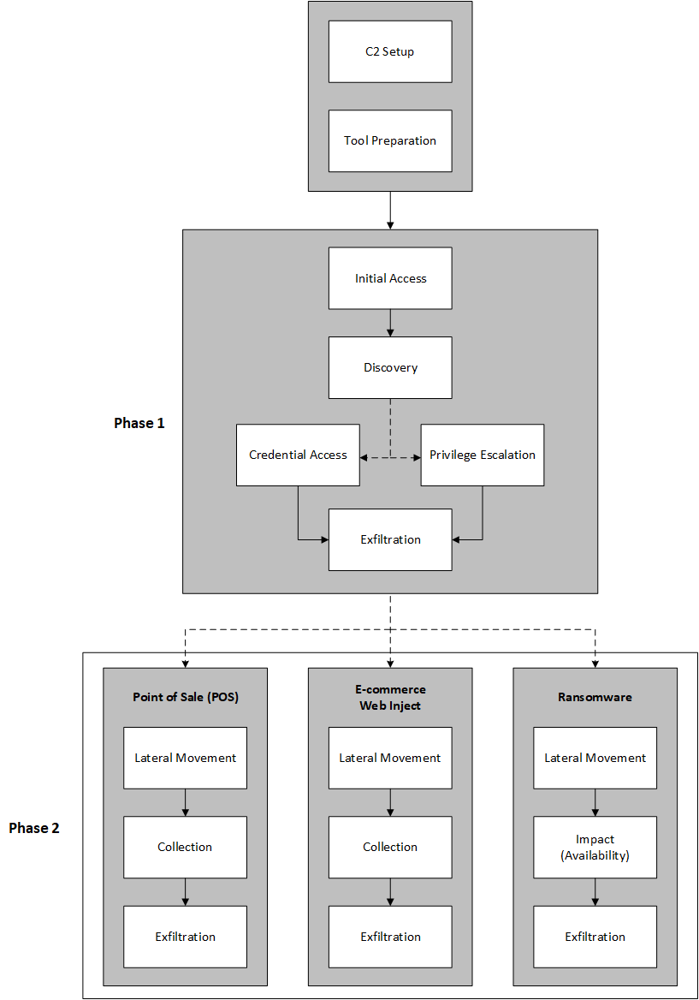

Three Dimensions of Threat-Informed Defense
=============================================

How can an organization implement or improve their Threat-Informed Defense? The starting point depends on the degree to which the organization currently incorporates cyber threat information. Any organization can apply threat information to their cybersecurity approach. At a minimum, the organization can take the perspective of an adversary and think about what an adversary might do to disrupt their business through cyber. Thinking this way helps to identify priorities in security and leads to a series of questions such as: What adversaries are known to target my industry or even my company? What are these adversaries capable of? How well is my organization currently prepared to mitigate, detect, or resiliently operate despite a malicious cyber-attack by such adversaries? What should my organization do next to be better prepared? The three dimensions of Threat-Informed Defense described below help organizations determine where they are in this process and recommended practices for improving.

The goal of this project is to help any organization begin to incorporate threat in their security program. This paper provides both the understanding of *what* is Threat-Informed Defense as well as *why* Threat-Informed Defense is valuable. In addition, the best practices included in this paper provide a basis to measure the current state of leveraging threat-informed approaches in a security program, as well as how to improve a security program by implementing threat-informed best practices. In the sections that follow, the three main Dimensions of Threat-Informed Defense will be explained, as well as their key components. These components are discussed in more detail on the Key Components and Maturity Levels page, along with key best practices for each component.

The Center has historically described Threat-Informed Defense as a continuous process in which defenders and adversaries are constantly learning and evolving. To implement an effective Threat-Informed Defense, an organization must understand the threat and implement effective defensive measures. To understand the efficacy of existing or planned defensive measures and identify defensive gaps, an organization must evaluate their current posture, as well as potential new defensive measures, against the known threats. From a Defense perspective, this process takes place in three main Dimensions:

1. Cyber Threat Intelligence (CTI) 
2. Defensive (Counter) Measures 
3. Testing & Evaluation 

These three elements are the core of implementing a quality Threat-Informed Program. Crucial to this idea of Threat-Informed Defense is this imperative of proactive defense. 
An effective Threat-Informed Defense must continuously learn and evolve to optimally implement defensive measures to keep pace with new threats and technologies. 

   CTID Threat-Informed Defense Cycle

In the sections that follow, the three main Dimensions of TID will be explained, as well as their key components. These components are discussed in more detail on the Key Components and Maturity Levels page, along with key best practices for each component. 

Cyber Threat Intelligence - Know the Adversary
----------------------------------------------

The first major dimension of Threat-Informed Defense is Cyber Threat Intelligence, which is focused on understanding the adversary. This dimension measures how well the organization understands known behaviors of cyber adversaries; which specific adversaries are targeting its industry, technologies, or geography; and their motivations and typical objectives. Ultimately CTI programs enable organizations to produce a tailored threat model of the highest priority adversary behaviors, which ultimately informs the rest of the defensive program. Example capabilities such as the `Top 10 ATT&CK Technique Calculator <https://top-attack-techniques.mitre-engenuity.org/calculator>`_ can help organizations with this initial tailoring based on a variety of factors.

   CTID Top ATT&CK TTP Calculator

The `Cyber Threat Intelligence Lifecycle <https://recordedfuture.com/blog/threat-intelligence-lifecycle-phases>`_, a product from `Recorded Future <https://www.recordedfuture.com/>`_, consists of Direction, Collection, Processing, Analysis, and Dissemination. The components in the M3TID model exist as the inputs and outputs of the phases of the cycle. The combination of these components amount to how detailed an organization’s threat model and understanding of that threat model is.

   Recorded Future Threat Intelligence Lifecycle

The key Components of CTI are:

1. Depth of Threat Data
2. Breadth of Threat Information
3. Relevance of Threat Data
4. Utilization of Threat Information
5. Dissemination of Threat Reporting

As described in more detail below, ultimately this understanding from CTI directly informs the next two aspects of Threat-Informed Defense.

Defensive Measures - Proactively Defend
----------------------------------------

Defensive Measures is core to the concept of Threat-Informed Defense. Once an organization understands the adversary, if they do not implement real change in their organization based on what they learn then they are not achieving the impact of Threat-Informed Defense. Importantly, many organizations might consider that Threat-Informed Defense only applies to technical defenses, but the concept of being Threat-Informed should apply across all aspects of a security program. An example of evolving defensive measures is the `Summitting the Pyramid (StP) <https://mitre-engenuity.org/cybersecurity/center-for-threat-informed-defense/our-work/summiting-the-pyramid/>`_  effort from the Center, which focuses on scoring and improving the quality of analytics to create detections that are more robust and core to Adversary behaviors.

   CTID Summiting the Pyramid

The key Components of Defensive Measures are:

1. Foundational Security
2. Data Collection
3. Detection Engineering
4. Incident Response
5. Deception Operations

Although improvements in defenses typically result in a technical defensive measure, that does not have to mean a firewall rule or a new analytic in a SIEM. Any action taken to make a network or system more secure can benefit from insight into threats. This could be stronger polices, prioritized patching, new detections, deception operations, or additional security training.

Testing & Evaluation - Learn and Improve
-----------------------------------------

Testing and Evaluation helps an organization validate and grow. By testing against adversary realistic TTPs, an organization can validate their defenses and illuminate their gaps. By continuously testing based on updated threat knowledge and new approaches to adversary TTPs, an organization maintains a realistic picture of their security posture. One example of leverage more tailored, threat-informed testing is to focus adversary emulation or purple-teaming testing on the typical behaviors and attack flow of specific, relevant adversaries. The graphic below shows the high level `FIN6 attack plan <https://medium.com/mitre-engenuity/center-releases-fin6-adversary-emulation-plan-775d8c5ebe9b>`_ taken from the Center’s `Adversary Emulation library <https://mitre-engenuity.org/cybersecurity/center-for-threat-informed-defense/adversary-emulation-library/>`_.

   CTID FIN6 Adversary Emulation Plan

Beyond that, testing can drive product or architecture changes to improve security, inform detection engineering and incident response, validate defensive controls, as well as other areas. Testing is an important way to rehearse before any real compromise occurs.

The key Components of T&E are:

1. Type of Testing
2. Frequency of Testing
3. Test Planning
4. Test Execution
5. Test Results

