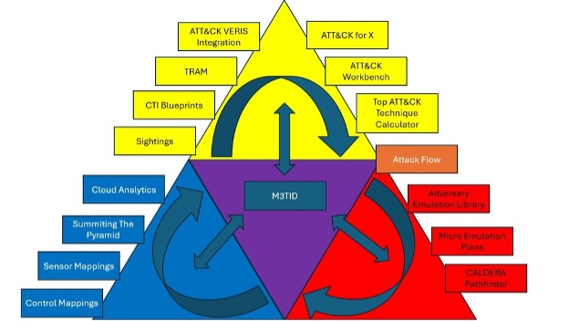

Moving Forward
===============

Once an organization has scored themselves with this model, they can identify key gaps to fill. The Center recommends an organization to start with any component that is currently scored as a zero because there is significant differentiated value in moving from zero to one in this model. Once an organization scores at least a one in each component (including the scores of service providers, if various portions of the Security program are out-sourced), the Center recommends that organizations work to improve the CTI and Defensive Measures scores in parallel as a priority. Testing and evaluating those components is valuable, but they must first exist to test and evaluate. Because of this, the overall score puts less weight on the Test and Evaluation dimension.  

   Alignment of CTID Projects to M3TID

The M3TID maturity model is meant to be a straightforward, easy to use tool for organizations to measure their current state, assess progress, and continuously refine and optimize their security posture by prioritizing based on threat-informed principles. The Center continues to provide a number of resources that reinforce or enable continuous improvement in all three of the Threat-Informed Defense Dimensions. By leveraging M3TID to understand their current maturity level and identifying areas for improvement, organizations can make targeted investments and strategic decisions to strengthen their defenses against the ever-evolving threat landscape. In the long run, this maturity model will help organizations optimize their resources, enhance their cybersecurity capabilities, and better protect their digital assets and infrastructure from potential attacks. 

M3TID Future Work
------------------

This model is intended to be a starting point which can be extended and expanded in several ways. The Center started with a breadth-first approach to framing up this space, identifying the three primary dimensions of Threat-Informed Defense and the first five components of each dimension. At this stage, a score would be the result of a qualitative self-assessment by knowledgeable practitioners in an organization, guided by the definitions of dimensions, components, and levels on the Key Components and Maturity Levels page. This framework is meant to be applicable to organizations of all sizes, and as such scoring should take into account organic “in house” capabilities as well as any capabilities delivered by 3rd party service providers like an MSP.  

In the future, this model could be extended to incorporate fine-grained sub-components with associated levels, more objective criteria for levels that tied to specific data sources and assessed by a 3rd party or automation, and additional components within the dimensions. The model could also be modified to improve on the quantification of levels and the scoring algorithm to better align with evidence on the relative importance of each component to bottom-line security efficacy. In the absence of such evidence, the Center needs to start by collecting data on the dimensions and components that the Center has hypothesized will prove most important based on existing research and experience.  

In this initial release of M3TID, we provide a proof-of-concept spreadsheet that enables an organization to assess themselves and see the resulting scores. This may be updated to a more interactive web application in a future release of M3TID, and potentially enable more automated measurement if the M3TID framework is extended to objective, specific data sources. 
