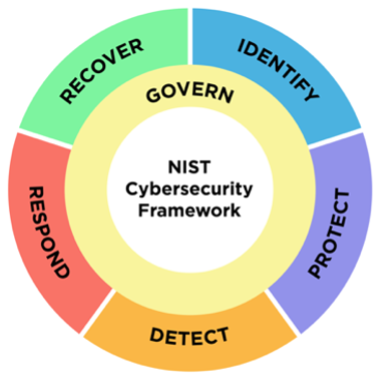

Getting Started with Threat-Informed Defense
=============================================

Why is Threat-Informed Defense Valuable?
-----------------------------------------

The intent of Threat-Informed Defense is to enable the collective resources of the defender to be greater than those of the adversary. There is too much theoretical adversary behavior for any individual defender to cover. Threat-Informed Defense identifies known adversary behavior, relevant to an organization’s threat model, and fosters a community-driven approach to enable an organization to proactively defend, self-assess, and improve defenses against those known threats. As a Threat-Informed Defense program and the community mature, long-term understanding of adversaries and their evolution enables defenders to identify how the adversary may evolve next. Ideally a predictive approach enables defenders to prioritize and optimize the scope of their practice and increases both cost and difficulty for the adversary. 

Who should consider Threat-Informed Defense?
--------------------------------------------

There is real value to be had by implementing a Threat-Informed Defense security program. All organizations, agnostic of size, revenue, or industry can leverage threat-informed approaches in their security programs. The goal of the M3TID project is to provide a model that any organization could use to assess themselves and then improve their implementation of a Threat-Informed Defense security program. However, it is important to note that there are key steps an organization should take to set a solid foundational security program. 

Any organization can benefit from “thinking like an adversary” to consider how they might be at risk from a cyber-attack and taking that into account as they design, operate, and maintain their systems. However, to optimally implement Threat-Informed Defense, an organization should have a functioning, foundational security program. This type of work is typically in the realm of compliance frameworks. Whether that be PCI [#f1]_ , SOC2 [#f2]_ , RMF [#f3]_ , or CMMC [#f4]_ to list just a few, these are a starting point for basic, foundational security and are complementary to the more threat-focused recommendations in this model.  

These existing frameworks do several things for an organization: 

* Provide a set of standardized guidelines, best practices, and requirements for organizations to follow to meet regulatory and industry-specific security standards.
* Focus on ensuring that organizations maintain a baseline level of security and adhere to legal and contractual obligations.
* Offer a structured and auditable approach to security, which can help organizations demonstrate their commitment to maintaining a secure environment.
* Typically cover a broad range of security controls, including administrative, physical, and technical measures. 

Applying these best practices and baseline security behaviors well, on a consistent basis, is the foundation an organization needs to implement a Threat-Informed Defense. 

Adding the Threat-Informed Perspective
--------------------------------------

Threat-Informed Defense is not intended to replace or obviate the need for a baseline security program but rather Threat-Informed Defense enhances an organization’s security program and gives it focus. Threat-Informed Defense is a crucial approach to cybersecurity that enables organizations to enhance their defenses proactively and adaptively against evolving threats. By focusing on understanding adversaries' TTPs, organizations can more effectively prioritize their defensive measures and make better-informed decisions about their security investments.  

Once the foundations are in place, Threat-Informed Defense empowers organizations to: 

* Understand relevant adversaries' TTPs to prioritize and tailor an organization's defensive measures. 
* Proactively self assess based on real-world adversary behaviors, identifying and mitigating gaps prior to actual intrusions. 
* Enable an agile security posture by adapting defenses based on a constantly evolving knowledge of adversaries and threat-realistic self-assessment results.  

How does Threat-Informed Defense align with my existing Security Program?
-------------------------------------------------------------------------

Threat-Informed Defense is complementary to other cybersecurity programs, such as NIST’s Cyber Security Framework (CSF). In NIST’s CSF [#f5]_, cybersecurity functions are categorized as belonging to one of Govern, Identify, Protect, Detect, Respond, and Recover.  

   NIST CSF 2.0

In Threat-Informed Defense, all those functions can be threat-informed to varying degrees and in different ways. Some specific examples for each phase of the NIST CSF are provided below: 

* Identify: Inform understanding of risk and risk measurement based on an informed understanding of particular adversaries that are known to target a specific industry, geographical area, or technology by leveraging the ATT&CK Workbench [#f6]_ or Sightings [#f7]_.
* Protect: Prioritizing patch deployment based on the probability that a relevant adversary will exploit the related vulnerability on an organization’s systems is an example of threat-informed protection. An excellent example of threat informed protection is the Exploit Prediction Scoring System (EPSS) [#f8]_ which prioritizes vulnerabilities based on the probability that they will be exploited based on real-world exploitation information.
* Detect: Detection is greatly enhanced by being threat informed. Without a knowledge of the threat, detection must rely on statistical deviations from a baseline, or on allow-listing. Unfortunately, most networks have such large variation in their baseline activity that it is relatively easy for adversaries to “hide” in the noise, and difficult for analysts to filter out false positives. Most detection is already threat-informed to some extent by at least leveraging feeds of “known-malicious” indicators of compromise such as domain names or malware signatures, which are easier for an adversary to change compared to TTPs. To improve those detections, a more advanced threat-informed defense would leverage deep insight into the underlying and difficult-to-avoid behaviors that are core to malicious activity. This concept is well-documented in SpecterOps’ blog series [#f9]_, MITRE’s TTP-Based Hunting [#f10]_ , and the Center’s Summiting the Pyramid [#f11]_ work.  
* Respond: Responders who understand adversary campaigns and behaviors more deeply can uncover the broader picture of malicious activity in their network and take more effective responsive action. For example, a quick isolation response to the first piece of malware discovered might only alert the adversary to being discovered and cause them to adjust accordingly and evade further detection, whereas a broader understanding of the adversary’s intentions, capabilities, and previous campaigns might lead the responders to investigate further, discover other likely targets within the network, identify crucial chokepoints in the adversary’s intrusion, and take a more decisive action in evicting the adversary. 
* Recover: Organizations can validate their backup and recovery plans by testing themselves against realistic adversary tradecraft using the Adversary Emulation Library [#f12]_ or Micro Emulation Plans [#f13]_. These are particularly valuable for testing recovery in ransomware scenarios

The CSF is primarily focused on an understanding of the systems being defended and general best-practices for cybersecurity. A Threat-Informed Defense complements that with knowledge of adversary tactics, techniques, procedures, tools, tradecraft, and intentions. This Threat-Informed Defense model is not intended to replace frameworks such as the CSF but to document how to incorporate threat information into the relevant components of a full cybersecurity program. For that reason, a high score in this model indicates that threat knowledge is being optimally utilized to guide defensive investments and actions. 

.. rubric:: References

.. [#f1] https://www.pcisecuritystandards.org/
.. [#f2] https://www.aicpa-cima.com/resources/landing/system-and-organization-controls-soc-suite-of-services
.. [#f3] https://csrc.nist.gov/Projects/risk-management/about-rmf
.. [#f4] https://dodcio.defense.gov/CMMC/Model/
.. [#f5] https://www.nist.gov/cyberframework
.. [#f6] https://mitre-engenuity.org/cybersecurity/center-for-threat-informed-defense/our-work/attck-workbench/
.. [#f7] https://mitre-engenuity.org/cybersecurity/center-for-threat-informed-defense/our-work/sightings-ecosystem/
.. [#f8] https://www.first.org/epss/
.. [#f9] https://posts.specterops.io/capability-abstraction-fbeaeeb26384
.. [#f10] https://www.mitre.org/sites/default/files/2021-11/prs-19-3892-ttp-based-hunting.pdf
.. [#f11] https://center-for-threat-informed-defense.github.io/summiting-the-pyramid/
.. [#f12] https://mitre-engenuity.org/cybersecurity/center-for-threat-informed-defense/adversary-emulation-library/
.. [#f13] https://mitre-engenuity.org/cybersecurity/center-for-threat-informed-defense/our-work/micro-emulation-plans/

