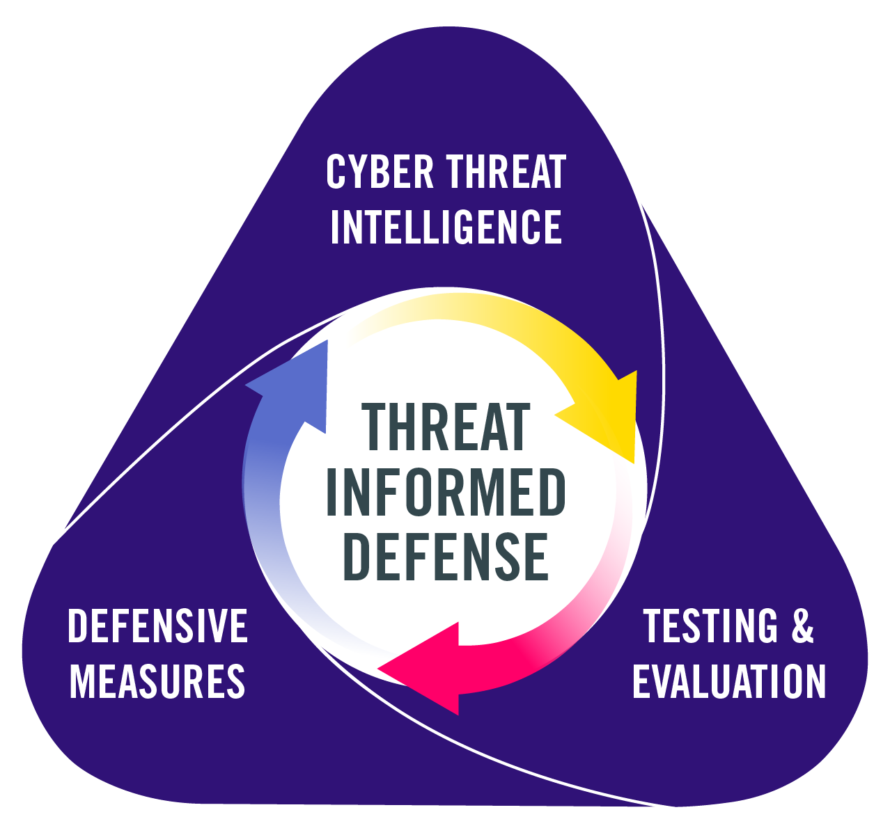

Measure, Maximize, and Mature Threat-Informed Defense |version|
===============================================================

The Measure, Maximize, and Mature Threat-Informed Defense (M3TID) project defines what
threat-informed defense is and the key activities associated with its practice. The
project captures insights and best practices for what it means to be threat-informed
across a security program, expanding the dimensions of threat-informed defense into key
components that organizations can implement. For each of these components, the project
defines specific elements of implementation maturity, which enables organizations to
assess and to understand the current and future state of their threat-informed defense
program.

This project is created and maintained by `MITRE Center for
Threat-Informed Defense <https://ctid.mitre.org/>`__ in futherance of our
mission to advance the start of the art and and the state of the practice in
threat-informed defense globally. The project is funded by our `research participants
<https://ctid.mitre.org/projects/measure-maximize-and-mature-threat-informed-defense-m3tid/>`__.

.. toctree::
    :maxdepth: 2
    :caption: Contents

    what-is-tid
    getting-started
    dimensions
    measuring
    maxmature
    forward
    conclusion
    changelog
    components/index
    spreadsheet

Notice
------

© |copyright_years| MITRE. Approved for public release. Document number(s)
|prs_numbers|.

Licensed under the Apache License, Version 2.0 (the "License"); you may not use this
file except in compliance with the License. You may obtain a copy of the License at
http://www.apache.org/licenses/LICENSE-2.0

Unless required by applicable law or agreed to in writing, software distributed under
the License is distributed on an "AS IS" BASIS, WITHOUT WARRANTIES OR CONDITIONS OF ANY
KIND, either express or implied. See the License for the specific language governing
permissions and limitations under the License.

This project makes use of ATT&CK®: `ATT&CK Terms of Use
<https://attack.mitre.org/resources/terms-of-use/>`__
