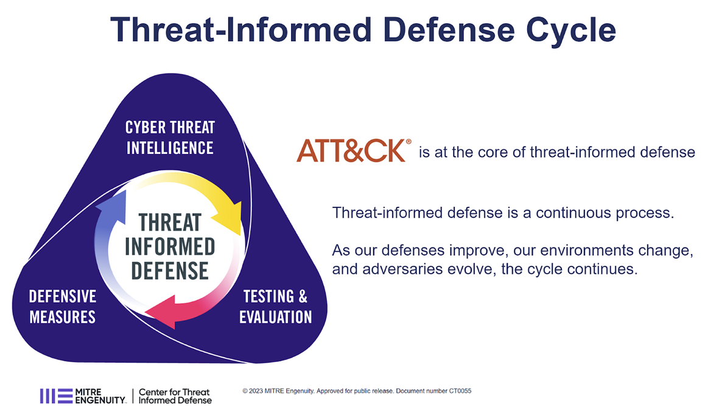

.. vim: syntax=rst

Table of Contents
=================

`Introduction <#introduction>`__ `4 <#introduction>`__

`Background <#background>`__ `4 <#background>`__

`The M3TID Project <#the-m3tid-project>`__ `4 <#the-m3tid-project>`__

`What is TID and Why is it Important? <#what-is-tid-and-why-is-it-important>`__ `5 <#what-is-tid-and-why-is-it-important>`__

`Definition <#definition>`__ `5 <#definition>`__

`Built on the Foundation of ATT&CK <#built-on-the-foundation-of-attck>`__ `5 <#built-on-the-foundation-of-attck>`__

`A Continuous Process <#a-continuous-process>`__ `6 <#a-continuous-process>`__

`Getting Started with TID <#getting-started-with-tid>`__ `6 <#getting-started-with-tid>`__

`Why is TID Valuable? <#why-is-tid-valuable>`__ `6 <#why-is-tid-valuable>`__

`Who should consider TID? <#who-should-consider-tid>`__ `6 <#who-should-consider-tid>`__

`Adding the Threat-Informed Perspective <#adding-the-threat-informed-perspective>`__ `8 <#adding-the-threat-informed-perspective>`__

`Implementing TID <#implementing-tid>`__ `9 <#implementing-tid>`__

`Three Dimensions of TID <#three-dimensions-of-tid>`__ `9 <#three-dimensions-of-tid>`__

`Cyber Threat Intelligence – Know the Adversary <#cyber-threat-intelligence-know-the-adversary>`__ `10 <#cyber-threat-intelligence-know-the-
adversary>`__

`Defensive Measures – Proactively Protect <#defensive-measures-proactively-protect>`__ `10 <#defensive-measures-proactively-protect>`__

`Testing & Evaluation – Learn and Improve <#testing-evaluation-learn-and-improve>`__ `11 <#testing-evaluation-learn-and-improve>`__

`How does TID align with my existing security program? <#how-does-tid-align-with-my-existing-security-program>`__ `11 <#how-does-tid-align-with-my-
existing-security-program>`__

`Measure, Maximize, Mature Threat Informed Defense (M3TID) <#measure-maximize-mature-threat-informed-defense-m3tid>`__ `11 <#measure-maximize-mature-
threat-informed-defense-m3tid>`__

`Methodology <#methodology>`__ `11 <#methodology>`__

`Weighting and Scoring <#weighting-and-scoring>`__ `12 <#weighting-and-scoring>`__

`Overall TID Measurement <#overall-tid-measurement>`__ `12 <#overall-tid-measurement>`__

`Cyber Threat Intelligence – Key Activities and Maturity Levels <#cyber-threat-intelligence-key-activities-and-maturity-levels>`__ `12 <#cyber-threat-
intelligence-key-activities-and-maturity-levels>`__

`Defensive Measures – Key Activities and Maturity Levels <#defensive-measures-key-activities-and-maturity-levels>`__ `12 <#defensive-measures-key-
activities-and-maturity-levels>`__

`Test & Evaluation – Key Activities and Maturity Levels <#test-evaluation-key-activities-and-maturity-levels>`__ `12 <#test-evaluation-key-activities-
and-maturity-levels>`__

`Example Scoring <#example-scoring>`__ `12 <#example-scoring>`__

`Leveraging the Model as a Roadmap <#leveraging-the-model-as-a-roadmap>`__ `12 <#leveraging-the-model-as-a-roadmap>`__

`Conclusion <#conclusion>`__ `13 <#conclusion>`__

Introduction
============

Background
----------

Globally, security practitioners, security program leaders, and Board members seek to answer the question “Are we secure?” But how do you answer that
question in a defensible way? How do you appropriately prioritize to build an effective Security program that adequately balances investments in
people, processes, or technologies to fill gaps and reduce risk to acceptable levels?

The Center for Threat Informed Defense (CTID) contends that one of the most impactful ways to manage your security program is to prioritize based on
the knowledge of actual threat actors, their capabilities, and their typical tactics, techniques, and procedures (TTPs).
By understanding the adversary well, we can prioritize our defenses as well as pre-emptively assess ourselves to identify gaps and blindspots.
This enables us to shift to a more proactive approach to security, constantly learning, assessing and improving our security programs, ultimately
shifting the cost and difficulty back onto the adversaries.
This is especially true if we work in a community, achieving impacts that are more exponential in scale than a single organization working in a
vacuum.

The M3TID Project
-----------------

The Measure, Maximize, Mature Threat Informed Defense (M3TID) project extends this concept of leveraging Threat understanding to improve your security
program by working towards a more tangible definition of TID and its associated key activities.
The M3TID project is based on the research hypothesis that applying Threat-Informed Defense (TID) will both improve the effectiveness of a security
program and reduce organizational risk.
The project will capture insights and best practices for what it means to be Threat-Informed across a Security Program, distilling these into a set of
key activities that organizations should execute for a Threat-Informed Defense (TID)-based security program.
For these key activities, the M3TID project will define maturity levels for what it means to execute that activity in a non-threat-informed way up to
a highly mature threat-informed implementation.

The intent of the M3TID project is that organizations, from security practitioners to executive leaders, will be able to leverage this maturity
framework to better assess and understand their current position in terms of a TID-based security program, as well as using the maturity criteria to
develop a Roadmap to guide key next steps or investments to improve their level of TID.
Once published, we plan to iterate on this framework to determine if the hypothesis is true – that implementation of tangible, mature TID does
measurably improve effectiveness and reduce risk.

What is TID and Why is it Important?
====================================

Definition
----------

The definition of Threat Informed Defense (TID) is “the systematic application of a deep understanding of adversary tradecraft and technology to
improve defenses.” The goal is to leverage knowledge of real adversary behavior and probability of attacks or exploitation to provide the lens through
which to prioritize security investments – whether they be of people, new or improved processes, or new or re-architected technology implementations.

|M3TID002|

Built on the Foundation of ATT&CK
---------------------------------

Short explanation of ATT&CK

Explain how TID uses ATT&CK

Explain broader shift to focus on understanding and then defending against behaviors.
Reference the pyramid of pain

A Continuous Process
--------------------

Driven by evolving IT environment, changing security capability, and threats

Not static, never done

As defenses improve we learn about adversaries.
We improved ability

Getting Started with TID
========================

Why is TID Valuable?
--------------------

The intent of TID is to enable the collective resources of the defender to be greater than those of the adversary.
There is too much theoretical adversary behavior for any individual defender to cover.
Threat Informed Defense identifies known adversary behavior, relevant to your organization’s threat model, and enables a community-driven approach to
proactively defend, self-assess, and improve defenses against those known threats.
As a TID program and community mature, long-term understanding of adversaries and their evolution enables defenders to identify how the adversary may
evolve next.
This goal of a predictive approach enables defenders to optimize the scope of their practice and increases both cost and difficulty for the adversary.

Who should consider TID?
------------------------

The first question to address is what organizations can find real value from implementing a TID-based security program? The high level answer to this
question is all organizations, agnostic of size, revenue, or industry can realize real value by leveraging threat-informed approaches in their
security programs.
And that is the goal of the M3TID project, a maturity model that any organization could use to assess themselves and then improve their implementation
of a TID-driven security program.
However, the details become a bit more nuanced.

If you are just starting out in your security program, or you have not yet reached compliance with your applicable regulatory requirements, then
moving directly to TID may not be the best decision.
To implement TID, it assumes that an organization already has a functioning, foundational security program.
This type of work is typically in the realm of compliance frameworks.
Whether that be PCI, SOC2, RMF, or CMMC to list just a few, these are the starting point.

|M3TID003|

Compliance frameworks do several things for an organization:

-  Provide a set of standardized guidelines, best practices, and requirements for organizations to follow in order to meet regulatory and industry-
  specific security standards.

-  Focus on ensuring that organizations maintain a baseline level of security and adhere to legal and contractual obligations.

-  Offer a structured and auditable approach to security, which can help organizations demonstrate their commitment to maintaining a secure environment.

-  Typically cover a broad range of security controls, including administrative, physical, and technical measures.

Applying these best practices and baseline security behaviors well, on a consistent basis, is the foundation you need.
Security hygiene, patching, secure configurations, user training, boundary and endpoint defenses, appropriate policies and security processes …these
are the basic hygiene requirements that you need to have in place.
Once this initial program is in place, organizations can begin to ask questions like “We’ve invested, but are we secure?” “How do we know our defenses
work?” “How do we focus and prioritize our security resources to have the best impact for the business?” Once an organization is ready to begin asking
and answering these questions, and they’ve met that initial foundational security bar, they are ready to start considering TID approaches mature their
programs and answer those questions in a way that is tailored to their unique threat landscape.

Adding the Threat-Informed Perspective
--------------------------------------

TID does not counter your baseline security program or compliance approach, but rather it enhances it and gives it focus.
TID is a crucial approach to cybersecurity that enables organizations to enhance their defenses proactively and adaptively against evolving threats.
By focusing on understanding adversaries' tactics, techniques, and procedures (TTPs), organizations can more effectively prioritize their defensive
measures and make better-informed decisions about their security investments.
This approach is different from and adds to the best practices or standards-based baseline of compliance-based security.
Compliance focuses on ensuring you meet legal and regulatory requirements, while TID keeps you focused on the countering the adversary.

Once the foundations are in place, TID empowers organizations to:

-  Focus on understanding the adversaries' tactics, techniques, and procedures (TTPs) to prioritize and tailor an organization's defensive measures.

-  Emphasize continuous learning from past incidents and sharing knowledge across the security community.

-  Enable organizations to be proactive in their security posture by adapting their defenses based on the evolving threat landscape.

-  Promote flexibility in security controls and processes, allowing organizations to respond effectively to specific threats.

Implementing TID
================

TID is a continuous process.
Our businesses, technologies, IT environments, and user base are constantly changing, and the adversary is constantly evolving.
In the midst of that change, we must constantly iterate to not only defend ourselves, but ideally increase the cost and difficulty for the adversary.
That is accomplished through the three main dimensions of TID, described below:

Three Dimensions of TID
-----------------------

The Center for Threat-Informed Defense has historically described TID as a continuous process in which defenders and adversaries are constantly
learning and evolving.
From a Defense perspective, this process takes place in three main Dimensions:

1. Cyber Threat Intelligence (CTI)

2. Defensive Measures

3. Testing & Evaluation

These three elements, further discussed below, are the core of implementing a quality Threat-Informed Program.
Crucial to this idea of Threat-Informed Defense, though, is this imperative of proactive defense.
We are focused on deliberately learning and improving our defenses, not simply learning for the sake of having additional data.
Simply gaining understanding is not enough, it is continually implementing that learning and then continuing to learn and grow.

|M3TID004|

Cyber Threat Intelligence – Know the Adversary
----------------------------------------------

The first major dimension of TID is Cyber Threat Intelligence, which is really focused on knowing and understanding the adversary.
What are the known behaviors of Cyber adversaries writ large, what are their typical behaviors, tradecraft, and tools? Moving beyond that, what
specific adversaries are targeting my industry or my geography? What are their motivations and typical objectives?

As described in more detail below, ultimately this understanding from the CTI function directly informs the next two aspects of Threat-Informed
Defense, as well as receiving “demand” from those areas to produce CTI for areas our understanding may be lacking.

Defensive Measures – Proactively Protect
----------------------------------------

Defensive Measures is core to the concept of TID.
Once we understand the adversary, if we do not implement real change in our organizations based on what we learn then we are not achieving the impact
of TID.
Importantly, many organizations might consider that TID only applies to technical defenses, but the concept of being Threat-Informed should apply
across your security program.
This would typically result in a defensive measure, but that does not have to mean a firewall rule or a new analytic in a SIEM.
Any portion, and ideally most portions, of a Security program would leverage TID for prioritization.

Testing & Evaluation – Learn and Improve
----------------------------------------

CTI is what informs our understanding of the Adversary and Defensive Measures is where we proactively protect ourselves, but Test and Evaluation is
where we learn and grow.
By testing ourselves against adversary-realistic tactics, techniques, and procedures (TTPs), we can validate our defenses and illuminate our gaps.
By continuously testing ourselves based on updated threat knowledge and new approaches to adversary TTPs, we maintain a proactive picture of our
security posture.
Beyond that, testing can drive product or architecture changes to improve security, inform detection engineering and incident response, validate our
defensive controls, and other areas.
Testing is the key way that we rehearse before the real compromise occurs.

How does TID align with my existing security program?
=====================================================

<This would be a good place to discuss the overlap between TID and the NIST CSF>

Measure, Maximize, Mature Threat Informed Defense (M3TID)
=========================================================

Now that we’ve discussed what TID is, why it is important, and the three main dimensions or components of TID, now we come to three key question: What
specific activities do I need to become Threat-Informed? How Threat-Informed is my security program now? What are the next steps I need to take to
improve my level of Threat-Informed Defense?

All of these questions lead us to a need to measure TID, something that has not been done before.
In the sections that follow, the three Dimensions of TID will be further decomposed into their key activities, with measures for each key activity.

Methodology
-----------

To ensure consistency, we developed the following steps to approach TID measurement:

-  Each of the TID Dimensions is decomposed into a number of key activities

-  For each of those key activities, we developed 5 discrete levels of maturity from least to most threat-informed

-  Within a TID Dimension (eg CTI), all its subordinate key activities are weighted equally

-  At the TID Dimensions level, the Dimensions themselves are weighted

Weighting and Scoring
---------------------

In this section we should describe the philosophy behind our equation, the “equation” itself, and a discussion and explanation of the weighting.
After that, we should show example.
Either here or in the methodology section we should discuss that there is a score at the Dimension level, and an overall TID Maturity score.
For the TID Maturity score, based on the weighting, we should note the “maximum” score possible.

Overall TID Measurement
-----------------------

Cyber Threat Intelligence – Key Activities and Maturity Levels
--------------------------------------------------------------

Defensive Measures – Key Activities and Maturity Levels
-------------------------------------------------------

Test & Evaluation – Key Activities and Maturity Levels
------------------------------------------------------

Example Scoring
---------------

Leveraging the Model as a Roadmap
=================================

In this section, we can discuss, based on weighting, that once you’ve scored yourself you can zero in on what you should do next to best impact that
score or improve your overall TID maturity.
Easier to do this by referencing the example, so we can note the “next steps” for that sample organization.

The M3TID maturity model will be an invaluable tool for organizations to measure their progress and continuously refine their security posture.
By understanding their current maturity level and identifying areas for improvement, organizations can make targeted investments and strategic
decisions to strengthen their defenses against the ever-evolving threat landscape.
In the long run, this maturity model will help organizations optimize their resources, enhance their cybersecurity capabilities, and better protect
their digital assets and infrastructure from potential attacks.
This is the main focus of the M3TID project.
Once you are ready to move forward with a TID-driven program, how do you measure your progress, and how do you know what do next to improve your
maturity?

Conclusion
==========

Need to develop conclusion verbiage here

