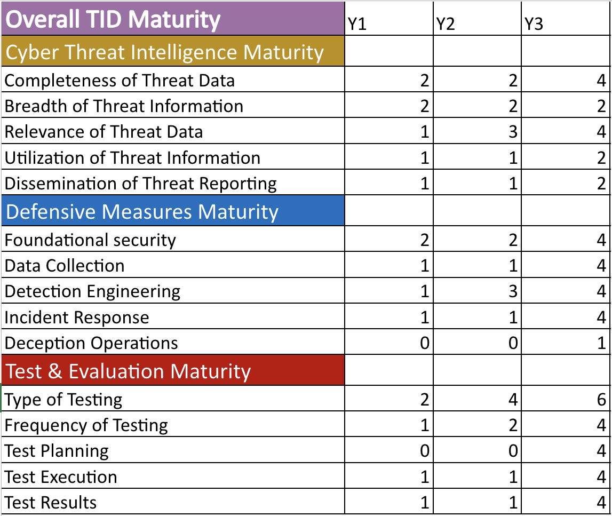
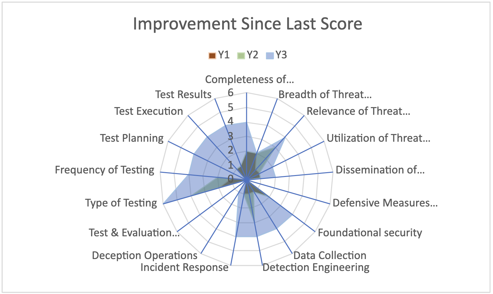

Maximize & Mature Threat-Informed Defense
==========================================

As an organization evaluates their current degree of incorporating threat information in their cybersecurity, they will likely identify gaps. Closing each gap comes at a cost and provides some differential benefit relative to their current posture. The Center advises that an organization considers the options for closing gaps through a portfolio analysis, taking into account that some investments may provide benefits across more than one Threat-Informed Defense component. For example, improved training of cybersecurity personnel might enable them to develop better data collection, detection engineering, and incident response solutions. A portfolio analysis approach can also help to optimize across multiple investment opportunities that have overlapping benefits. For example, adding an Endpoint Detection and Response (EDR) Tool may improve the Threat-Informed Defense score, whereas adding two similar EDR tools won’t provide double the benefit. Additionally, some investments may need to precede others. For example, a Threat Model and good CTI understanding of those threat behaviors is necessary before you can use that information to inform tailored Detection Engineering or Testing.

The options to close gaps are likely to be in the form of people, processes, technologies, policies, and/or services. In some cases, an organization may need more people to increase capacity, or they may not have anyone yet for a particular role. In other cases, the number of people may be sufficient, but they require additional education and/or training. As with all of the components, these might be direct employees, or the staff associated with a service provider. Processes need to be in place, documented, understood, regularly implemented, and aligned with the needs of Threat-Informed Defense. For example, an organization may have skilled adversary emulators, but if no process exists to conduct regular purple teaming, those skills are not being fully utilized. Of course, technologies are key to enabling skilled staff to implement good processes. Organizations should consider how best to augment or replace existing tools to optimize their overall coverage of their prioritized Threat Model. Finally, even the best teams, processes, and tools can’t succeed if policy prohibits their effective employment. Policies need to carefully balance resource constraints, privacy, safety, efficiency, and efficacy. Cybersecurity professionals might benefit from translating the technical jargon and focus of their analysis to the policy language and business focus of the policy personnel.

Improvement
------------

To illustrate the impact of leveraging the best practices in the M3TID framework to improve Threat-Informed Defense, this section will continue leveraging the same fictitious Company A from the previous section and re-assess the organization after multiple improvements were made. In this example, Company A considers the M3TID best practices and maturity levels, and determines to implement the following improvements: 

* CTI: Subscribe to a customized threat intelligence feed. 
* DM: Dedicate additional resources to developing and tuning detection analytics for identified adversary techniques. 
* T&E: Institute a semi-annual purple team. 

Those changes result in the following updated scores and the accompanying graphs: 

   Improved TID and Component Scores

   Kiviat Diagram: Comparison of Improved TID Dimensions

   Kiviat Diagram: Comparison of all Improved TID Components

Tracking Improvement over Time
------------------------------

One purpose of this model is to improve over time, so by an organization continually scoring themselves, they can see how their score may increase. An organization may want to consider adding a historical record tab in their scoring spreadsheet to log their changes over time.  

   Multi-Year Overall TID and Dimension Scores

   Kiviat Diagram: Component Improvement Over Time

   Line Graph: Improvement Over Time

   Bar Graph: Improvement Over Time

