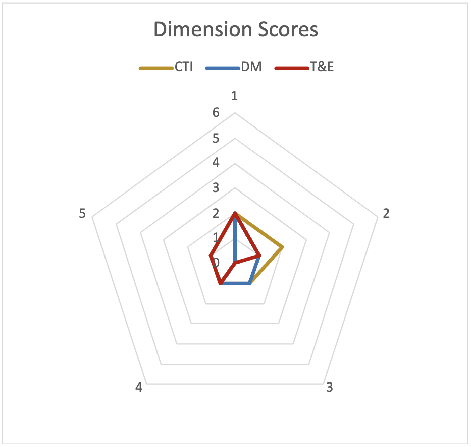

Measuring Threat-Informed Defense
==================================

Now that Threat-Informed Defense has been defined, its importance emphasized, and the three main dimensions have been covered, there are three key questions: What specific 
activities do I need to become Threat-Informed? How Threat-Informed is my security program now? What are the next steps I need to take to improve my level of Threat-Informed 
Defense?  

All of these questions lead to a need to measure Threat-Informed Defense, something that has not been done before. In Appendix A, the three Dimensions of Threat-Informed 
Defense are further decomposed into an initial set of components, with measures for each component from least-to-most threat-informed. In the sections that follow the 
methodology to leverage those components to assess a security program are explained. The methodology is then applied to an exemplar organization for demonstration purposes. 

Methodology
-----------

To ensure consistency, the following steps were developed to approach Threat-Informed Defense measurement: 

* Each of the Threat-Informed Defense Dimensions is decomposed into five key components. 
* For each of those components, five discrete levels of maturity, from least to most threat-informed, were developed. 
* Within a Threat-Informed Defense Dimension (e.g. CTI), all of its subordinate components are weighted equally. 
* At the Threat-Informed Defense Dimensions level, the Dimensions themselves are weighted. 

 
See Appendix A for the defined key components and maturity levels for all three dimensions of Threat-Informed Defense. These component and maturity levels form the basis for 
the assessment and scoring further described below. 

Weighting and Scoring
---------------------

This scoring system consists of three parts. Each of the three dimensions has five components, and each component has five levels. Scoring is accomplished primarily at the 
“level” portion of the framework. 

Each level has a number of points associated with it, which are “earned” if the organization satisfies the requirements of that level. These points are cumulative, so if an 
organization satisfies the requirements of level 1 or 2, they earn 1 point each; satisfying level 3 or 4 earns 2 points each; satisfying both level 1 and 4 earns 3 points 
(1+2=3 points) for that component. The score for each component can therefore range from 0 to 6. The score for a Dimension is the average of the scores for every component in 
that dimension. This results in Dimension scores that also range from 0 to 6.  

Overall Threat-Informed Defense Scoring
----------------------------------------

The total score for an organization is currently computed as a weighted sum of the Dimension scores. The logic behind this cumulative score is that taking defensive action is 
the most important component to a Threat-Informed Defense. The importance of CTI is greater than that of test and evaluation based on the experience of the Center and its 
Participants. This final formula is not meant to be extremely precise, but rather reflects the “best engineering judgment” of the M3TID team and Participants. As with most 
other frameworks and maturity models, each organization can, and should, tune and tailor this formula based on their needs and constraints. 

Example Scoring
---------------

As a notional example of implementing this assessment and scoring approach, imagine a fictitious Company A. Company A has invested in their security program and met a minimum 
acceptable level of compliance with their industry standard. They are beginning their approach to implement Threat-Informed Defense, but are doing so unevenly. Based on their 
current investments, the bullets below describe their current state of Threat-Informed Defense in each Dimension: 

Company A: In-house implementation of a nascent threat-informed defense. 

* CTI: The organization has CTI on IOCs and software used across multiple ATT&CK Techniques. Analysts occasionally read freely available generic reports and disseminate IOCs to the rest of the team. 
* DM: Despite excellent CTI, the company has not leveraged that CTI effectively to prioritize their investments in Defensive Measures. They automatically apply patches, collect data as per standard best-practices, run a set of imported SIGMA rules, respond to alerts as needed, and do not conduct any deception operations. 
* T&E: The company is only minimally investing in Testing & Evaluation, limiting their current testing to an annual penetration test that is not tailored to any specific adversary or set of adversary behaviors.  

To aid in leveraging this methodology for assessment, this paper is being released with a Proof of Concept spreadsheet-based calculator. The screenshots below are taken from 
the Results tab of that calculator. 

   Overall TID and Component Scores

   Kiviat Diagram: Comparison of TID Dimensions

   Kiviat Diagram: Comparison of all Key TID Components

After an organization conducts this initial assessment and understands the current status of their threat informed defensive program, the scoring and associated visualizations 
highlight opportunities to improve their program. The section that follows will describe approaches to improving threat-informed defense maturity once an initial baseline is 
understood.  
