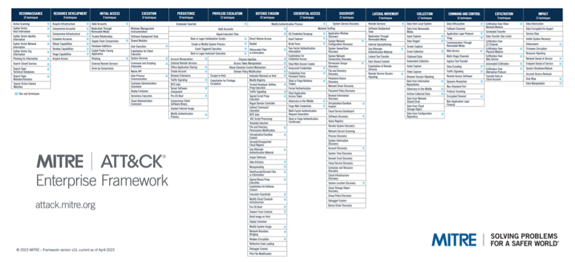

What is Threat-Informed Defense?
================================

.. epigraph::

   Threat-Informed Defense is the systematic application of a deep understanding of
   adversary tradecraft and technology to improve defenses.

   -- The Center for Threat-Informed Defense

Overview
----------

Threat-informed defense is closely related to risk management as it encourages the
prioritization of defensive investments based on potential impact and the probability of
occurrence. Threat-Informed Defense differs from traditional risk management in that it
prioritizes the likelihood of a threat occurring and informs that probability from
real-world observations of actual adversary tradecraft. Informing a defensive posture
with real threat information is a way to ground the probability estimation in evidence.
To further maximize the return on threat-driven investments, Threat-Informed Defense
encourages the use of threat information that is common across adversaries and time
rather than simply reacting to easily changed indicators of malicious activity. The goal
is to leverage knowledge of real adversary behavior and probability of attacks to
provide a lens through which to prioritize security investments – whether they be in
people, processes, or technology.

The Center for Threat-Informed Defense (the Center) contends that one of the most
impactful ways to manage a security program is to leverage knowledge of cyber threats to
prioritize the allocation of limited resources to reduce overall risk. As risk is the
product of probability and impact, it is crucially important to have a thorough
knowledge of actual threat actors, their capabilities, and their typical tactics,
techniques, and procedures (TTPs). By understanding the adversary well, an organization
can prioritize their defenses as well as pre-emptively and continuously assess
themselves to identify gaps. This enables organizations to shift to a more proactive
approach to security, constantly learning, assessing, and improving their security
programs. The goal of this shift is to increase the cost and difficulty for the
adversaries thereby increasing security. Forcing adversaries to create new tooling, find
new vulnerabilities and exploits, and attempt to discover new paths into an
organization’s environment drives their cost in manpower, infrastructure, and time. It
also forces them to restart their attack lifecycle, creating additional opportunities
for detection and response. The ultimate goal is to raise the adversary's costs enough
to deter some attacks.

Leveraging ATT&CK
-------------------------

There are many types of threat information and many sources from which to learn about
threats. `MITRE ATT&CK® <https://attack.mitre.org/>`_ provides a convenient aggregation
of publicly reported TTPs used by adversaries and other valuable information about how
to detect and mitigate them. It has become a common way to categorize and refer to
adversary TTPs across the community, which enables more widespread and efficient
collaboration on cyber threat intelligence. By documenting adversarial activity at the
TTP level, ATT&CK helps defenders think at a level of abstraction that is concrete
enough to be actionable, but abstract enough to remain stable over time and across
adversaries. This combination of stability and actionability creates great potential for
a high return on investment when defending against those threats.

   ATT&CK Framework (https://attack.mitre.org)

David Bianco famously depicted this potential with his `“Pyramid of Pain”
<http://detect-respond.blogspot.com/2013/03/the-pyramid-of-pain.html>`_, which
illustrates how difficult it is for an adversary to evade a defense that is informed by,
and effective against, different levels of information about adversary tradecraft. In
the Pyramid of Pain, indicators such as IP addresses, hash values, and domain names are
shown to be easy for an adversary to alter and thus evade defenses that are dependent on
them. However, TTPs are positioned at the top of the pyramid, reflecting the difficulty
an adversary would have if a defender was effectively detecting and mitigating at that
level.

.. figure:: _static/pyramidofpain.png
   :alt: Pyramid of Pain
   :align: center

   David Bianco's Pyramid of Pain

Threat-Informed defense focuses on understanding the adversaries that are most relevant
to an organization, based on industry, geography, and other factors. From there, ATT&CK
allows practitioners to understand the specific behaviors associated with those
adversaries. In this way, using ATT&CK as the foundation enables practitioners to focus
their efforts on a very specific, prioritized set of adversary behaviors and those
associated TTPs, optimizing their defensive program to the most likely and most
impactful threats.

A Continuous Process
--------------------

An effective threat-informed defense must keep pace with the evolving IT environment,
changing security capabilities, and threats. New versions of software and operating
systems introduce new patches to old vulnerabilities, new auditing capabilities, new
benign activities that might cause false positives, and unfortunately new attack
surfaces and unintended vulnerabilities. Security vendors and products are also
evolving. These constant updates, reconfigurations, and other changes mean that
organizations must constantly maintain awareness of their IT environment, their attack
surface, and their data collection and detection capabilities. Changes to the
environment must be accounted for to ensure that changes did not create new attack
surfaces, gaps, or otherwise invalidate current defensive capabilities.

Of course, the adversaries are not content to stand still and are relentlessly creating
new infrastructure, tools, and exploits. Adversaries will continue to use known,
effective tradecraft as long as we remain vulnerable to it, reserving their novel
capabilities to continue their operations despite improvements in security. This
reinforces the need to proactively secure against known adversary behavior to increase
their cost to attack. These many elements of change, our own and the adversary’s,
simultaneously create a dynamic cybersecurity landscape, so defenders must work
diligently to stay current. Yesterday’s security posture assessment may already be
outdated. Understanding threat information reported from other targeted organizations
and analyzing threat behaviors at the right level of abstraction are key elements to
optimizing a defender’s ability to keep pace with, or even get ahead of, the adversary.

