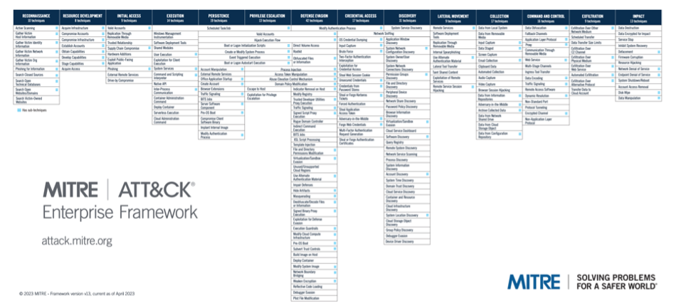
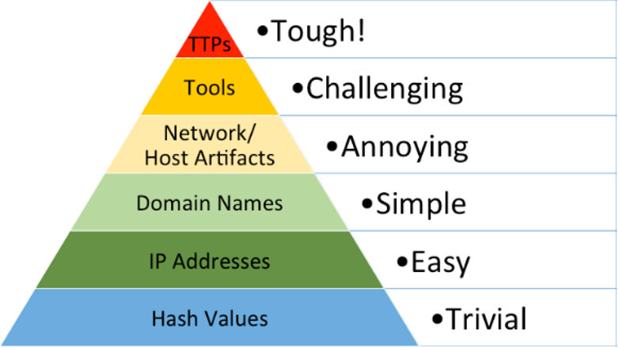

What is Threat-Informed Defense?
================================

Definition
----------

The definition of Threat-Informed Defense is “the systematic application of a deep understanding of adversary tradecraft and technology to improve defenses.” This approach is 
closely related to risk management as it encourages the prioritization of defensive investments based not only on potential impact, but also the probability of occurrence. 
Informing a defensive posture with real threat information is a way to ground the probability estimation in evidence. To further maximize the return on threat-informed 
defensive investments, Threat-Informed Defense encourages the use of threat information that is common across adversaries and time, rather than simply reacting to easily 
changed indicators of malicious activity. The goal is to leverage knowledge of real adversary behavior and probability of attacks to provide a lens through which to prioritize 
security investments – whether they be people, processes, or technology. 

Leveraging ATT&CK [#f1]_
------------------

There are many types of threat information, and many sources from which to learn about threats. MITRE’s ATT&CK® provides a convenient aggregation of publicly reported TTPs 
used by adversaries and other valuable information about how to detect and mitigate them. It has become a common way to categorize and refer to adversary TTPs across the 
community, which enables more widespread and efficient collaboration on cyber threat intelligence. By documenting adversarial activity at the TTP level, ATT&CK helps defenders 
think about threats at a level of abstraction that is concrete enough to be actionable, while also being abstract enough to stay relatively stable over time and across 
adversaries. This combination of stability and actionability creates great potential for a high return on investment when defending against those threats.

   ATT&CK Framework

David Bianco famously depicted this potential with his “Pyramid of Pain" [#f2]_ , which illustrates how difficult it is for an adversary to evade a defense that is informed 
by, 
and 
effective against, different types of indicators. In the Pyramid of Pain, indicators such as IP addresses, hash values, and domain names are shown to be easy for an adversary 
to alter and thus evade defenses that are dependent on them. However, TTPs are positioned at the top of the pyramid, reflecting the difficulty an adversary would have if a 
defender was effectively detecting and mitigating at that level. 

   Pyramid of Pain

Threat-Informed Defense focuses on understanding the main adversaries that are most relevant to an organization, based on industry, geography, and other factors. From there, 
ATT&CK allows practitioners to understand the specific behaviors associated with those adversaries. In this way, using ATT&CK as the foundation enables practitioners to focus 
their efforts on a very specific, prioritized set of adversary behaviors and those associated TTPs, optimizing their defensive program to those most likely or most impactful 
threats.

A Continuous Process
--------------------

An effective Threat-Informed Defense must keep pace with the evolving IT environment, changing security capabilities, and threats. New versions of software and operating 
systems introduce new patches to old vulnerabilities, new auditing capabilities, new benign activities that might cause false positives, and unfortunately new attack surfaces 
and unintended vulnerabilities. Security vendors and products are also evolving. These constant updates, reconfigurations, and other changes mean that organizations must 
constantly maintain awareness of their IT environment, their attack surface, and their data collection and detection capabilities. Changes to the environment must be accounted 
for to ensure that changes did not create new attack surfaces, gaps, or otherwise invalidate current defensive capabilities.  

Of course, the adversaries are not content to stand still and are relentlessly creating new infrastructure, tools, exploitations, and tradecraft to continue their operations 
despite improvements in security. These many elements change simultaneously to create a very dynamic cybersecurity landscape, so defenders must work diligently to stay 
current. Yesterday’s security posture assessment may already be outdated. Understanding threat information reported from other targeted organizations and analyzing threat 
behaviors at the right level of abstraction are key elements to optimizing a defender’s ability to keep pace with, or even get ahead of, the adversary. 

.. rubric:: References

.. [#f1] https://attack.mitre.org/
.. [#f2] http://detect-respond.blogspot.com/2013/03/the-pyramid-of-pain.html

